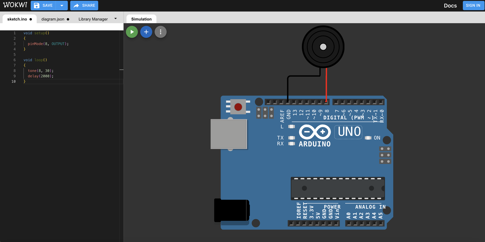
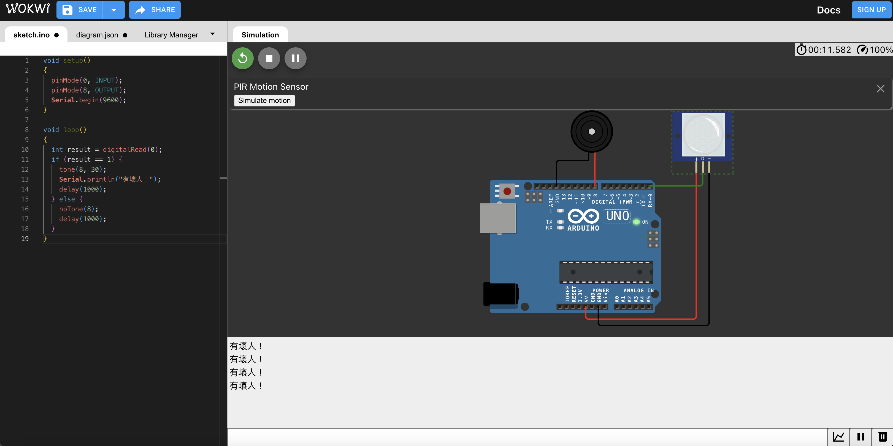

# 課程七

**教學主題：** 有壞人入侵
	
**目的：** 學習善用Buzzer與PIR motion sensor，來偵測壞人。

**操作解說：** 這門課程主要包含兩個學習重點，分別如下：
1. Buzzer.ino：透過蜂鳴器發出各種不同音調的聲音，線路配置如下圖所示：
 

	

 
2. Mix.ino：將上述Buzzer與PIR motion sensor結合在一起，可以偵測感應物體接近，並發出警報聲，以下為對應的線路配置圖：
 

	

 
