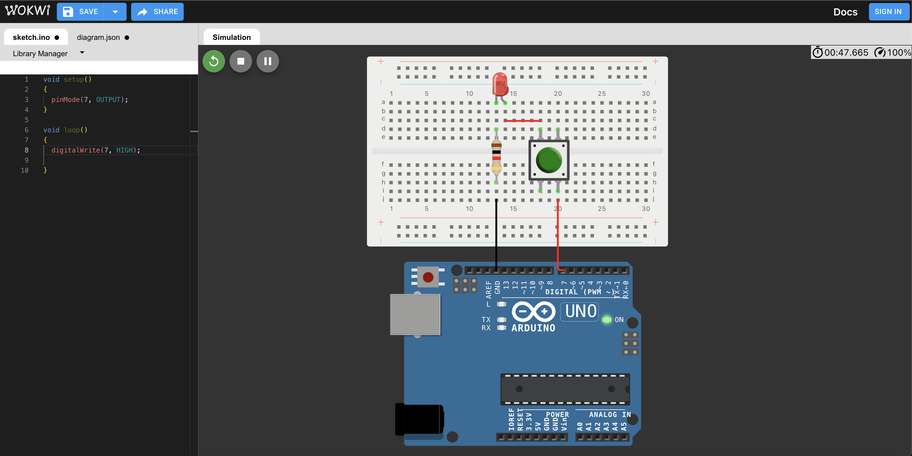
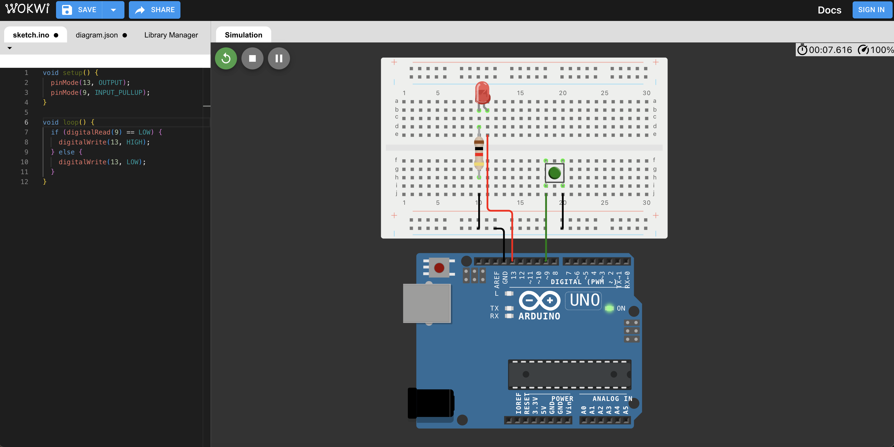
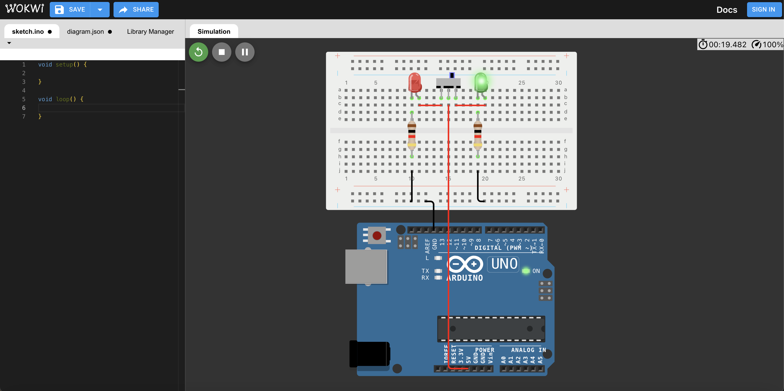

# 課程三

**教學主題：** 怎麼開燈呢？
	
**目的：** 學習善用Push Button、Slide Switchg，來控制電路。

**操作解說：** 這門課程主要包含三個學習重點，分別如下：
1. Pushbutton_1.ino：直接透過按壓Push Button，即可決定LED燈的開關狀態。線路配置如下圖所示：
 

	

 

2. Pushbutton_2.ino：按下Push Button後，程式將讀取通電狀態，並根據該狀態控制LED燈的開關(採用Arduino內建上拉電阻方式)。以下為對應的線路配置圖：
 

	

 
3. Pushbutton_3.ino：實現按壓Push Button一次讓LED燈開啟，再按一次則關閉。 
 

4. Slide Switchg的使用，以下為對應的線路配置圖，本練習不需要撰寫程式碼。
 

	

 
