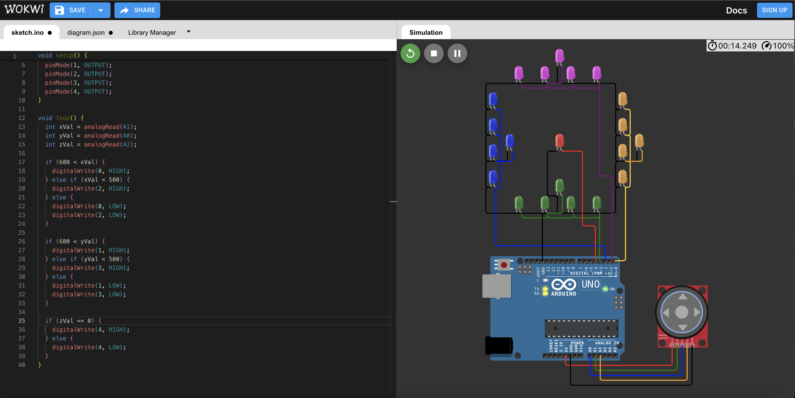

# 課程九

**教學主題：** 溫濕度顯示器
	
**目的：** 學習善用DHT與LiquidCrystal I2C元件，來完成溫濕度顯示器。

**操作解說：** 這門課程主要包含三個學習重點，分別如下：
1. Joystick_1.ino：透過DHT22(或DHT11)感測溫濕度，線路配置如下圖所示：
 

	

 

2. Joystick_2.ino：懂的使用LiquidCrystal I2C來顯示文字，以下為對應的線路配置圖：
 

	

 
