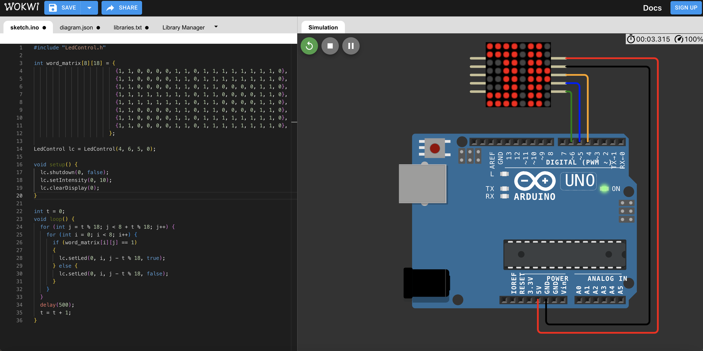

# 課程八

**教學主題：** 跑馬燈
	
**目的：** 學習善用max7219，來顯示文字。

**操作解說：** 這門課程主要包含四個學習重點，分別如下：(需要事先下載與安裝LedControl.h函式庫)
1. max7219_1.ino：懂的如何控制max7219中每一顆LED燈泡的亮滅。線路配置如下圖所示：
 

	

 

2. max7219_2.ino：理解如何使用隨機數，呈現不規則閃爍。線路配置圖同上，顯示如下所示：
 

	

 

3. max7219_3.ino：利用矩陣存載文字訊息與使用迴圈讀取，達到顯示預設文字的效果。線路配置圖同上，顯示如下所示：
 

	

 

4. max7219_4.ino：完成跑馬燈的最終形態。線路配置圖同上，顯示如下所示：
 

	

 

