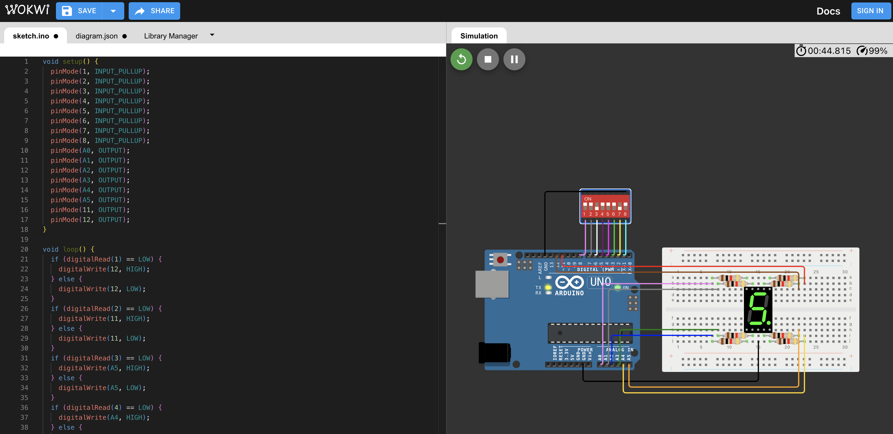

# 課程十

**教學主題：** 經典的計時器
	
**目的：** 學習如何顯示7 Segment。

**操作解說：** 這門課程主要包含三個學習重點，分別如下：
1. 7 Segment_1.ino：學習操控7 Segment的每個燈號，線路配置如下圖所示：
 

	

 

2. 7 Segment_2.ino：讓7 Segment成為經典的計時器，以下為對應的線路配置圖：
 

	

 

