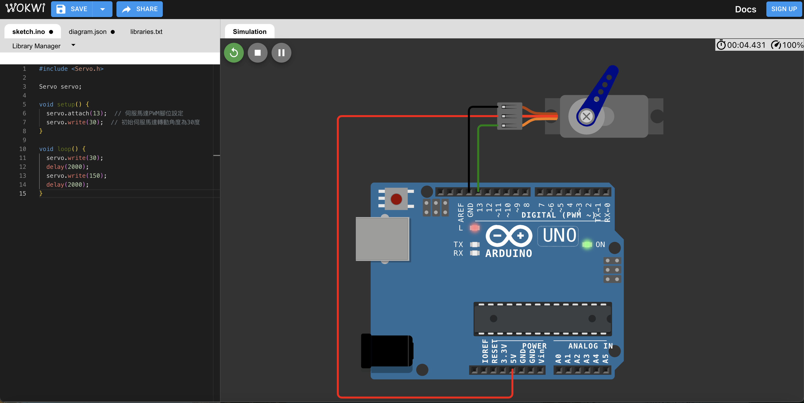
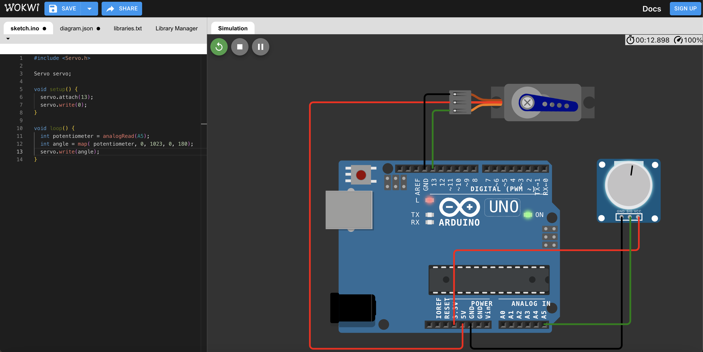

# 課程四

**教學主題：** 間歇性雨刷
	
**目的：** 學習善用伺服馬達、可變電阻，來控制機械裝置。

**操作解說：** 這門課程主要包含三個學習重點，分別如下：(需要事先下載與安裝Servo.h函式庫)
1. Servo_1.ino：主要學習如何讓伺服馬達一句指定角度擺動。線路配置如下圖所示：
 

	

 

2. Servo_2.ino：主要學習如何透過可變電阻，控制伺服馬達轉動角度。以下為對應的線路配置圖：
 

	

 
